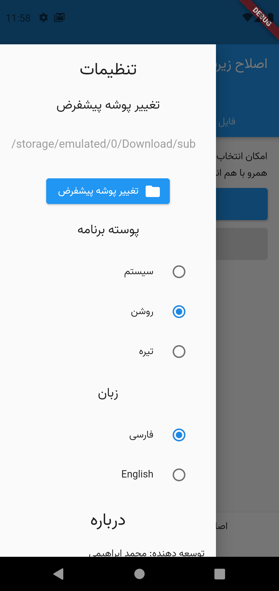
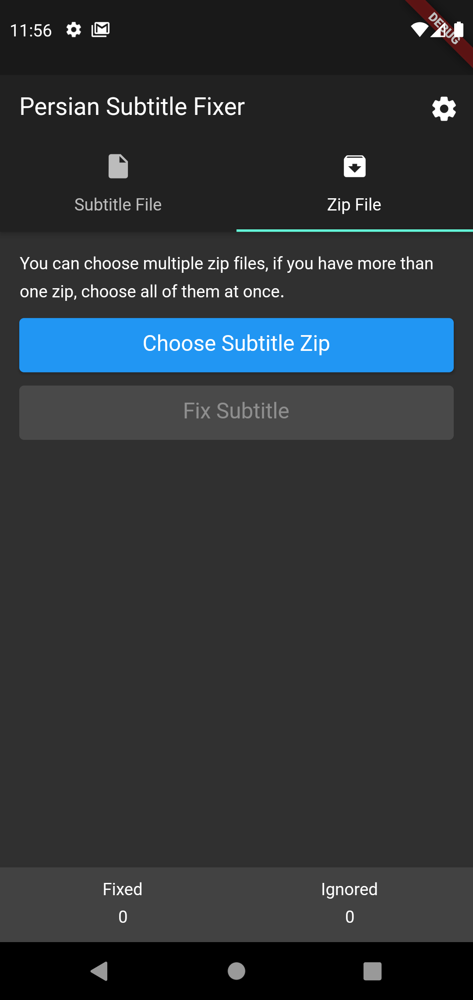

# اصلاح زیرنویس پارسی

# Persian Subtitle Fixer

## درباره
اپلیکیشن «اصلاح زیرنویس پارسی» با هدف اصلاح رمزگذاری (انکودینگ) فایل های زیرنویس فارسی طراحی شده است. این اپلیکیشن رمزگذاری فایل های زیرنویس را به UTF-8 تغییر می دهد. این برنامه از UTF-8، UTF-16 و Windows1256 به عنوان ورودی پشتیبانی می کند.

## About
"Persian Subtitle Fixer" application has been designed for fixing Persian subtitle encodings. This application converts subtitle file encodings to UTF-8. It supports UTF-8, UTF-16 and Windows1256 for input.

## پشتیبانی اندروید
کمترین نگارش مورد نیاز اندروید، اندروید ۵.۰ (API 21) است. از نگارش ۱.۰.۰، مشکل دسترسی به حافظه در اندروید ۱۱ را برطرف کردم و پشتیبانی از اندروید ۱۱ به برنامه اضافه شد.

## Android support

Minimum Android version requirements is Android 5.0 (API 21). From version 1.0.0, I fixed storage permission problems and Android 11 support added to Persian Subtitle  Fixer.

## پشتیبانی ios
از نگارش ۱.۰.۰، این برنامه از مدیریت فایل داخلی برای انتخاب پوشه پیشفرض استفاده می کند. بنابراین، از نظر تئوری محدودیتی برای پشتیبانی از ios وجود ندارد با این حال من سیستم مک ندارم و بنابراین نمی توانم پشتیبانی از ios را به برنامه اضافه کنم.

## IOS support
From version 1.0.0, this application uses native file manager for choosing default directory. So, Theoretically there is no limitations for ios support but I don't have any Mac machines, so I can't add support for ios.

## مجوز استفاده
این برنامه تحت مجوز [Mozilla Public License v2](./LICENSE) منتشر شده است.

## License
Persian Subtitle Fixer licensed under [Mozilla Public License v2](./LICENSE).

## نماگرفت 

## Screenshots

