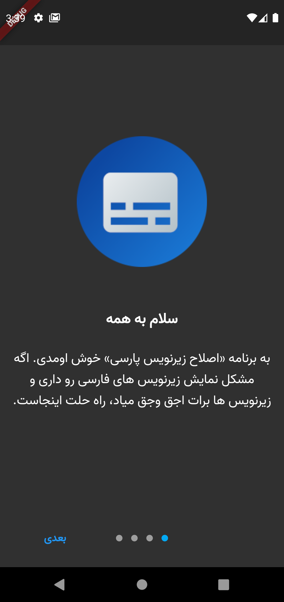
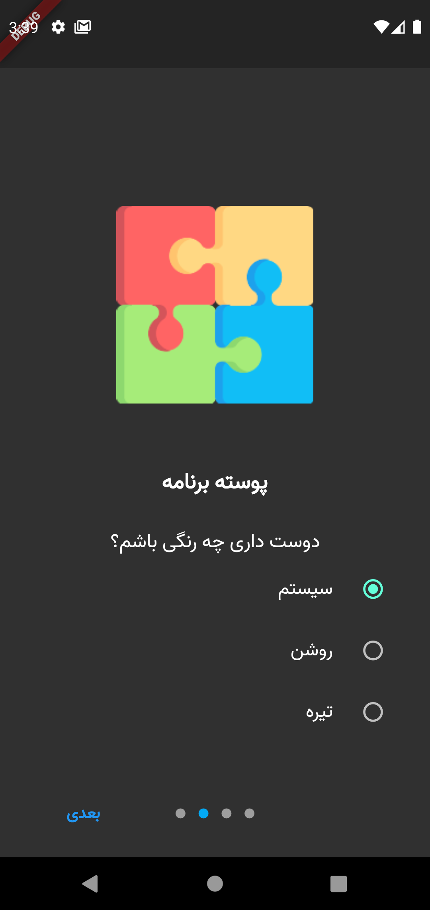
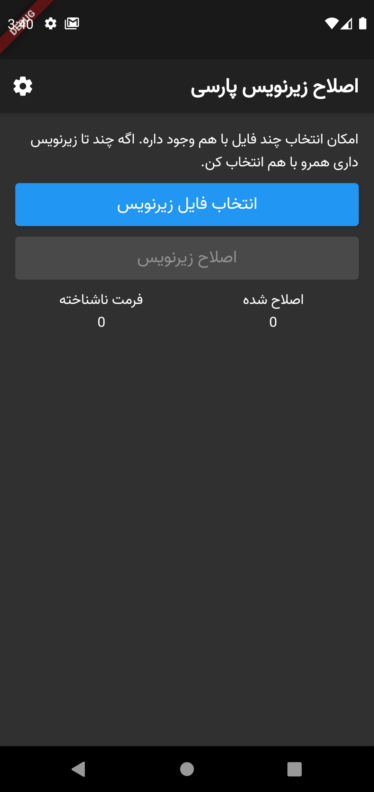
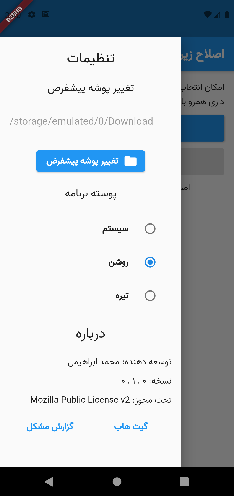

# اصلاح زیرنویس پارسی
## درباره
اپلیکیشن «اصلاح زیرنویس پارسی» با هدف اصلاح رمزگذاری (انکودینگ) فایل های زیرنویس فارسی طراحی شده است. این اپلیکیشن رمزگذاری فایل های زیرنویس را از windows-1256 به utf-8 تغییر می دهد. اگر زیرنویس ورودی شما utf-8 باشد مشکلی وجود ندارد و همان را به عنوان خروجی ذخیره می کند.
## پشتیبانی اندروید
به دلیل مشکلات دسترسی به حافظه برای ذخیره کردن زیرنویس ها در اندروید ۱۱ و بعد از آن، این اپلیکیشن برای شما به درستی کار نخواهد کرد. افزودن پشتیبانی برای نسخه های جدید منوط به اصلاح مجوزها در پکیج های فلاتر به کار رفته است.
## پشتیبانی ios
پکیج [easy_folder_picker](https://pub.dev/packages/easy_folder_picker) که در این اپلیکیشن به کار رفته است، تنها از اندروید پشتیبانی می کند. در صورت وجود پکیج مشابه برای ios امکان افزودن پشتیبانی برای آن وجود خواهد داشت. در حال حاضر این اپلیکیشن فقط برای اندروید موجود است.
## مجوز استفاده
این برنامه تحت مجوز [Mozilla Public License v2](./LICENSE) منتشر شده است.
## نماگرفت (Screenshots)

